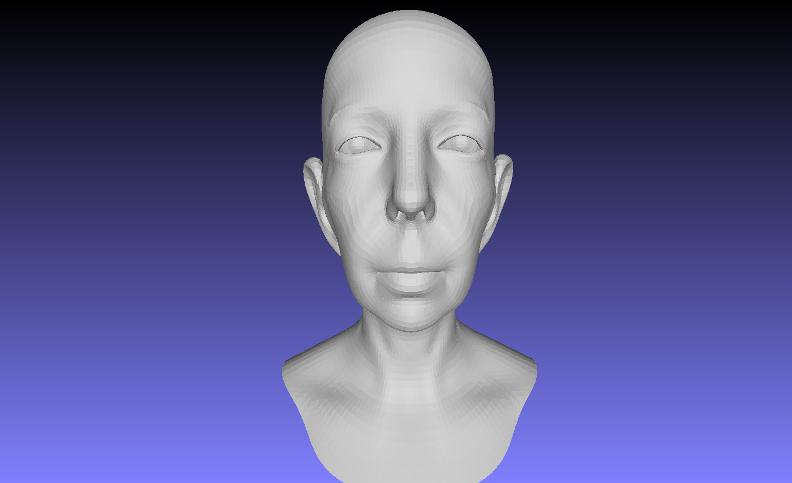
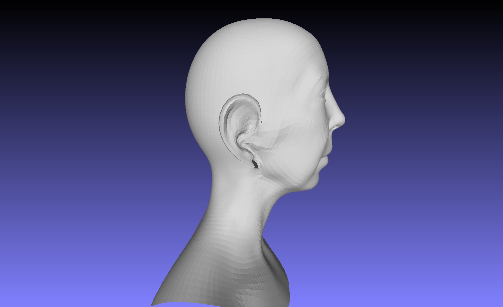
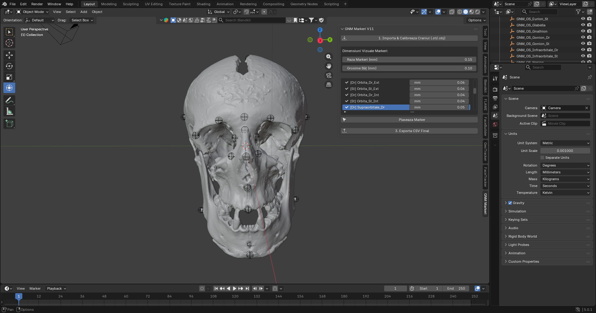

<div align="center">

# GNM Craniofacial Reconstruction Pipeline


*An end-to-end pipeline for craniofacial reconstruction from osteological 3D scans, built on the GNM (Generative aNthropometric Model and Ecosystem) parametric model.*

</div>

<br>

<table align="center">
<tr>
<td align="center" width="50%"><br><sub>Front view</sub></td>
<td align="center" width="50%"><br><sub>Profile view</sub></td>
</tr>
</table>

<p align="center"><sub>Sample facial reconstruction generated by the pipeline</sub></p>

---

## Table of Contents

- [Overview](#overview)
- [Key Features](#key-features)
- [Landmark Correlation Table](#landmark-correlation-table)
- [Workflow](#workflow)
  - [1. Blender Setup](#1-blender-setup)
  - [2. Reconstruction Pipeline](#2-reconstruction-pipeline)
- [Requirements](#requirements)
- [Disclaimer](#disclaimer)
- [Acknowledgments](#acknowledgments)

---

## Overview

This project provides an end-to-end technical solution for **craniofacial reconstruction** based on osteological data. It bridges the gap between 3D skull scans (osteology) and the **GNM** parametric model, enabling the generation of facial geometry (skin) that accurately adheres to the subject's anatomical landmarks.

The pipeline consists of two main components:

| Component | File | Role |
|---|---|---|
| **Blender Add-on** | `addon_v11.py` | Skull calibration (import, scaling, orientation), scientific landmark placement, and automated data export |
| **Python Processing Script** | `gnm_skull_to_face.py` | Spatial alignment (Umeyama algorithm) and regularized linear regression fitting of the GNM model onto anatomical data |

## Key Features

- 🦴 **Automated skull calibration** — imports `.stl` / `.obj` scans, corrects units and inverted normals, and centers the mesh automatically
- 📍 **Guided landmark placement** — a curated marker list keeps scientific landmark placement consistent and repeatable
- 🧮 **Mathematically rigorous fitting** — Umeyama spatial alignment plus regularized regression for anatomically grounded facial geometry
- 📤 **One-click CSV export** — landmark coordinates export directly in the format the reconstruction script expects

## Landmark Correlation Table

This table correlates the labels used in the Blender add-on interface with standard anthropological/anatomical terminology.

| Add-on Label | Scientific Name | Anatomical Region | Marker Type |
| :--- | :--- | :--- | :--- |
| **Nasion** | Nasion | Mid-sagittal | Exact (Vertex) |
| **Rhinion** | Rhinion | Mid-sagittal | Exact (Vertex) |
| **Glabella** | Glabella | Mid-sagittal | Exact (Vertex) |
| **Pogonion** | Pogonion | Mid-sagittal | Exact (Vertex) |
| **Gnathion** | Gnathion | Mid-sagittal | Exact (Vertex) |
| **Vertex_VarfCap** | Vertex | Mid-sagittal | Exact (Vertex) |
| **Nasospinale** | Nasospinale | Mid-sagittal | Barycentric |
| **Prosthion** | Prosthion | Mid-sagittal | Barycentric |
| **Gonion_Dr / St** | Gonion | Mandibular | Exact (Vertex) |
| **Orbita_Dr / St_Ext** | Ectoconchion | Orbital | Exact (Vertex) |
| **Orbita_Dr / St_Int** | Dacryon / Endocanthion | Orbital | Exact (Vertex) |
| **Supraorbitale_Dr / St** | Supraorbitale | Orbital | Exact (Vertex) |
| **Infraorbitale_Dr / St** | Infraorbitale | Orbital | Exact (Vertex) |
| **Zygion_Dr / St** | Zygion | Zygomatic | Exact (Vertex) |
| **Alare_Dr / St** | Alare | Nasal | Exact (Vertex) |
| **Eurion_Dr / St** | Eurion | Cranial | Exact (Vertex) |
| **Frontotemporale_Dr / St** | Frontotemporale | Temporal | Exact (Vertex) |

*`Dr` / `St` = right / left (dreapta / stânga)*

## Workflow

### 1. Blender Setup

1. **Install** — install the add-on via `Edit > Preferences > Add-ons > Install`.
2. **Import** — use **Import & Calibrate Skull**. The script automatically handles metric units (mm), centers the skull, and corrects inverted normals.
3. **Place Markers** — use **Load Marker List** to populate the slots, then select a marker and click the corresponding anatomical point on the skull mesh.
4. **Export** — generate the `.csv` file with **Export Final CSV**.

<p align="center">
  
  <br><sub>The GNM Markeri V11 panel — landmarks placed on the skull, with per-marker radius and stem thickness controls</sub>
</p>

> **⚠️ Known issue:** marker coordinates in the current add-on build are not actually in mm, despite the panel label. Convert them manually for now — this will be fixed in a future release.

### 2. Reconstruction Pipeline

Run the fitting script from your terminal to generate the facial mesh:

```bash
python gnm_skull_to_face.py --input markeri_gnm.csv --output reconstructie.obj
```

## Requirements

- **Blender 5+**
- **Python 3.x**, with:
  - `numpy`
  - `trimesh`
  - `gnm` (installation required per the official GNM documentation)

## Disclaimer

This tool is a personal project intended for anthropological research and 3D modeling purposes. Reconstruction accuracy is strictly dependent on the precise placement of anatomical markers and the biological quality of the input skull scan. Developed for digital anthropology and advanced craniofacial reconstruction workflows.

## Acknowledgments

Developed with help from Claude and Gemini.
